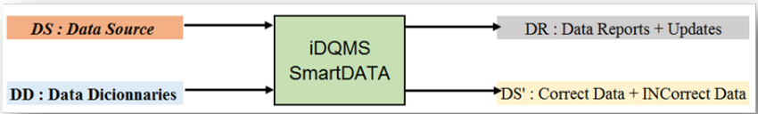
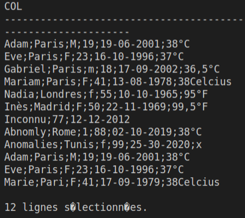
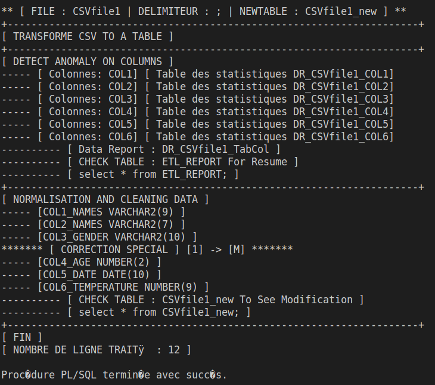
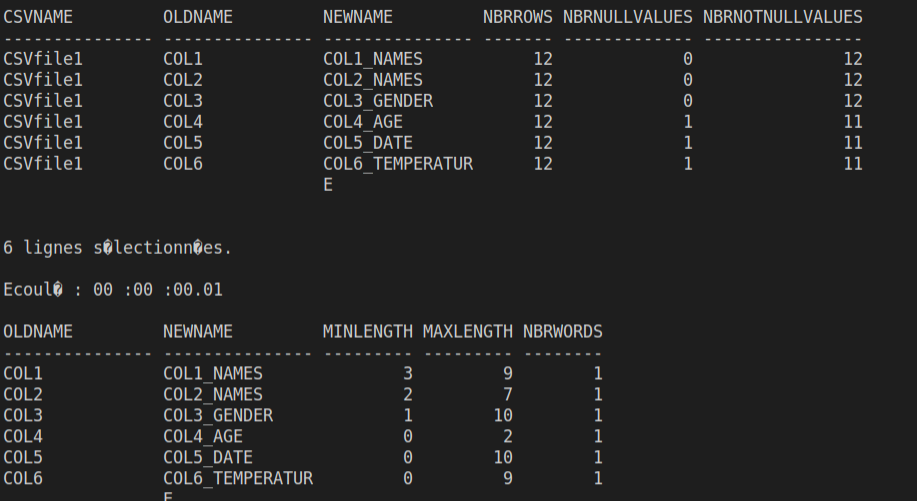
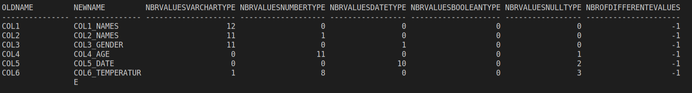
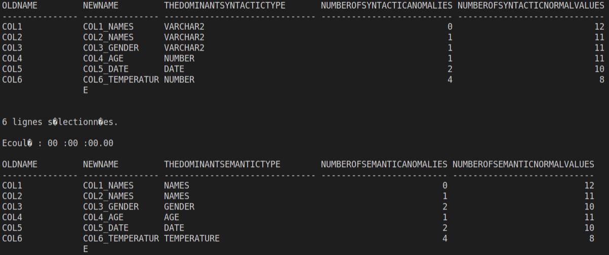
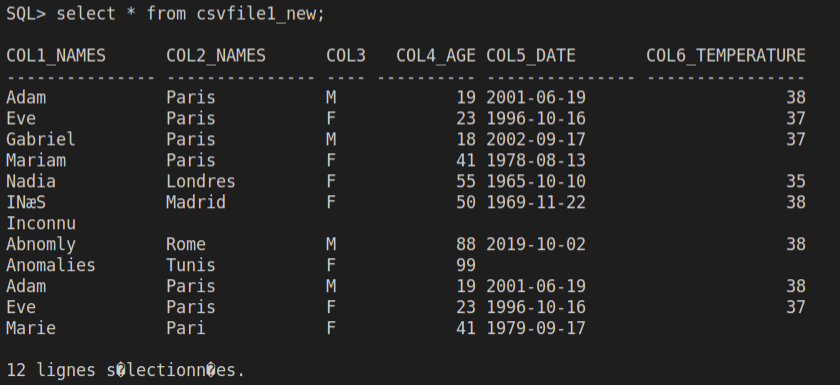

# Oracle ETL (Extract Transform and Load)
ETL ( PL/SQL - Oracle )

`iDQMS tool : An intelligent Data Quality Management System tool`
The main objectif of this project is to clean you data (from a csv file) so if you have a csv file with a lot of data and you don't know what that data mean, you have no idea of the schema behin it , but you want to be able to explore it and be able to get insights, this programme will help you.


## Code

1. [ETL](ETL)
2. [Data and Tables](ETL/tables)
3. [Trasform CSV format to a table format ](ETL/functions/CSV2TAB)
4. [Detect anomaly and generate statistics ](ETL/functions/DetectAnomaly)
5. [Normalize data based on statistics ](ETL/functions/NormalizeAndCleanData)

## Demo : csvFile1

### Before processing 


### During processing 
* Transforme CSV to Table


* Statistic 1


* Statistic 2


* Statistic 3


### After processing


## Default Test 
Connect to your oracle database and run  `@MAIN.sql`

## Personal Test 
1. Add your own csvfile in `tables_data_csv_file1.sql` [here]( Oracle/ETL/tables/tables_data_csv_file1.sql )

2. open oracle
3. run `@resouces` to load necessary tools
4. run
```sql
EXEC MyETL('CSVfile1' ,';' ,'CSVfile1_new' );
```
or personalize this file : `MAIN.sql` [here](ETL)


